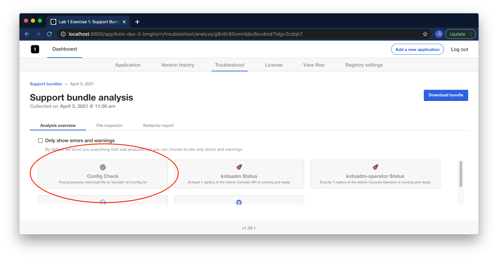
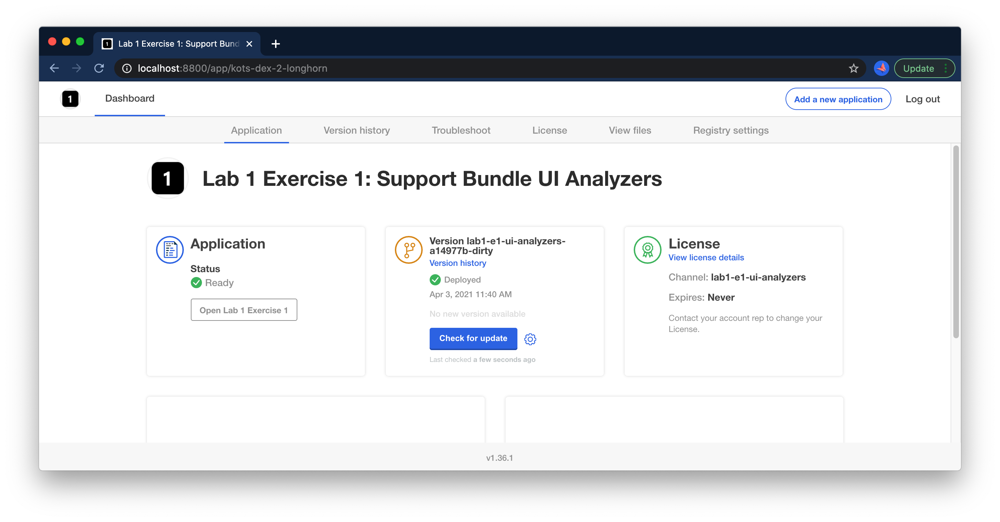
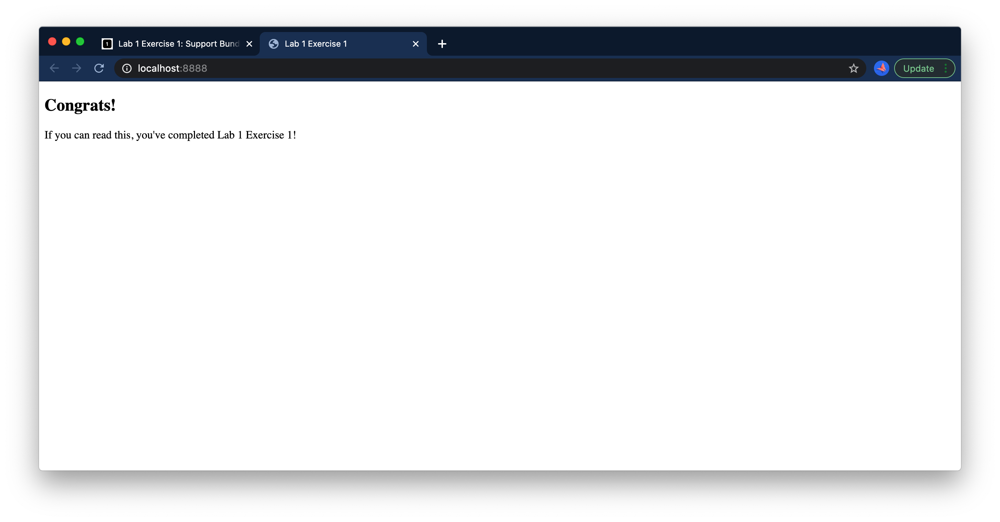

Lab 1 Exercise 1: Using Support Analyzers
=========================================

In this lab, we'll use the Support Bundle analyzers feature to debug an application, modifying the host in order to create the correct conditions for the application to start. In this case, the app is already deployed, but something is not quite right. The Status Informers show "Unavailable".


### Investigating

As you know, the first step when the application isn't starting will be to collect a support bundle. Doing so will run a series of diagnostic checks to help diagnose problems with the application. In the case that a problem cannot be diagnosed automatically, a bundle will be ready for download so you can share with your broader team to help diagnose the issue. Start by navigating to the "Troubleshoot" tab and clicking the "Analzye" button.


Once the bundle is collected, you should see an informative error message in the analyzers:


> Could not find a file at /etc/lab1-e1/config.txt with 400 permissions -- please ensure this file exists with any content

### Correcting

In order to correct this issue, you'll need to SSH your node and add this file. Assuming your environment is called `gmiller`.

<details>
  <summary>Expand for shell commands</summary>

```
sudo touch /etc/lab1-e1/config.txt
sudo chmod 400 /etc/lab1-e1/config.txt
```
</details>

### Validating

Running another support bundle, we should now see this check passes:





Furthermore, we should now see that the application shows ready in the admin console, and we can open it via the link:





Congrats! You've completed Exercise 1! [Back To Exercise List](../../)
